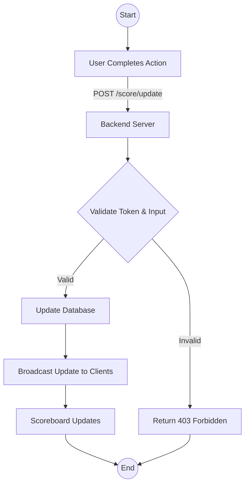
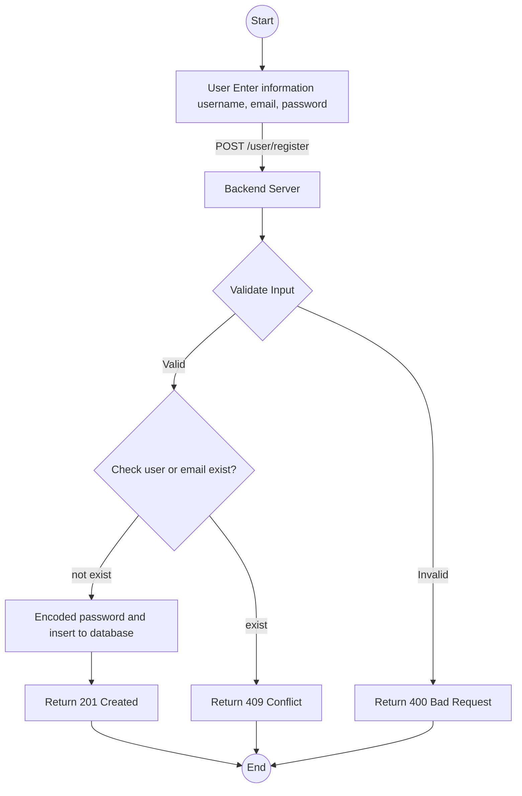
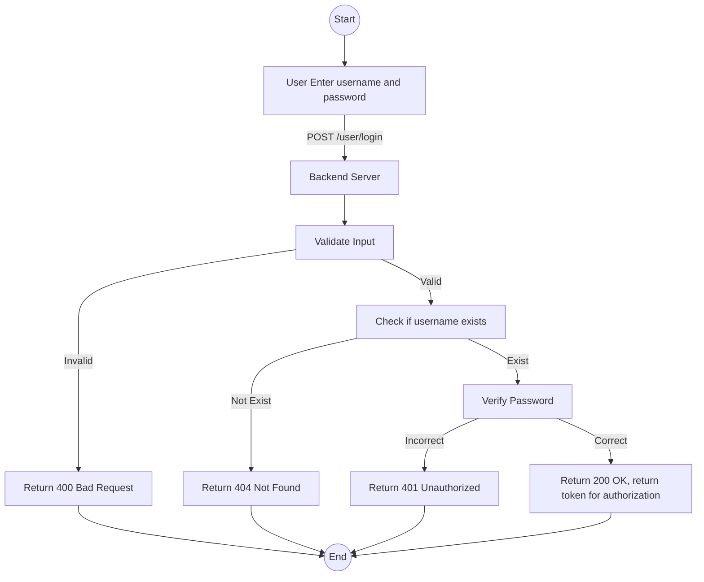

# API Service Specification for Live Scoreboard Update

## Overview

This module is responsible for maintaining a live scoreboard that displays the top 10 user scores on a website. It supports real-time updates and ensures security to prevent unauthorized score manipulations.

## Key Features

1. **Top 10 Scoreboard:**
   - Fetch and display the top 10 users' scores.
2. **Real-time Updates:**
   - Automatically update the scoreboard when a user's score changes.
3. **User Management:**
   - Provide API endpoints for user registration and login.
4. **Score Update Mechanism:**
   - Provide an API endpoint to securely update user scores after completing an action.
5. **Security:**
   - Implement measures to prevent unauthorized score increases.

## API Endpoints

1.  `GET /scoreboard`

    - **Description:** Retrieve the top 10 user scores.
    - **Response:**
      ```json
      [
         {
             "user_id": "12345",
             "username": "PlayerOne",
             "score": 1500
         },
      ...
      ]
      ```
    - **Response Codes:**
      - `200 OK`: Successful retrieval of the scoreboard
      - `500 Internal Server Error`: Server encountered an error.

2.  `POST /score/update`

    - **Description:** Update a user’s score after completing an action.
    - **Headers:** `Authorization: Bearer <auth_token>`
    - **Request Body:**

      ```json
      {
        "user_id": "12345",
        "score_increment": 10
      }
      ```

    - **Response:**

      ```json
      {
        "status": "success",
        "new_score": 1510
      }
      ```

    - **Response Codes:**
      - `200 OK`: Score successfully updated
      - `400 Bad Request`: Invalid request (e.g., missing fields)
      - `403 Forbidden`: Unauthorized attempt to update score
      - `500 Internal Server Error`: Server encountered an error.

3.  `POST /user/register`

    - **Description:** Register a new user.
    - **Request Body:**

      ```json
      {
        "username": "NewPlayer",
        "password": "securePassword123",
        "email": "player@example.com"
      }
      ```

    - **Response:**

      ```json
      {
        "status": "success",
        "messsage": "User registered successfully"
      }
      ```

    - **Response Codes:**
      - `201 Created`: User registered successfully
      - `400 Bad Request`: Invalid request (e.g., missing fields)
      - `409 Conflict`: Username or email already exists.
      - `500 Internal Server Error`: Server encountered an error.

4.  `POST /user/login`

    - **Description:** Log in an existing user.
    - **Request Body:**

      ```json
      {
        "username": "NewPlayer",
        "password": "securePassword123"
      }
      ```

    - **Response:**

      ```json
      {
        "status": "success",
        "auth_token": "secureToken123",
        "messsage": "Login successful."
      }
      ```

    - **Response Codes:**
      - `200 OK`: Login successful
      - `400 Bad Request`: Invalid request (e.g., missing fields)
      - `401 Unauthorized`: Invalid username or password.
      - `500 Internal Server Error`: Server encountered an error.

## Security Measures

1. **Authentication:**
   - Use a token-based authentication mechanism `(auth_token)` for all requests, passed in the `Authorization` header
2. **Validation:**
   - Verify user identity and validate the action before updating the score
3. **Input Sanitization**
   - Ensure inputs (e.g., score_increment) are within valid ranges and properly sanitized.

## Improvement Suggestions

1. **Scalability:**
   - Use caching mechanisms (e.g., Redis) to reduce database load for frequent GET /scoreboard requests.
2. **Observability:**
   - Implement logging and monitoring for API usage and error tracking.
3. **Replay Prevention:**
   - Use nonce values or timestamp-based tokens to prevent replay attacks.

## Diagram:

Below is the flowchart that illustrates the execution flow for updating the scoreboard:



Below is the flowchart that illustrates the execution flow for registering the user:



Below is the flowchart that illustrates the execution flow for Login:


